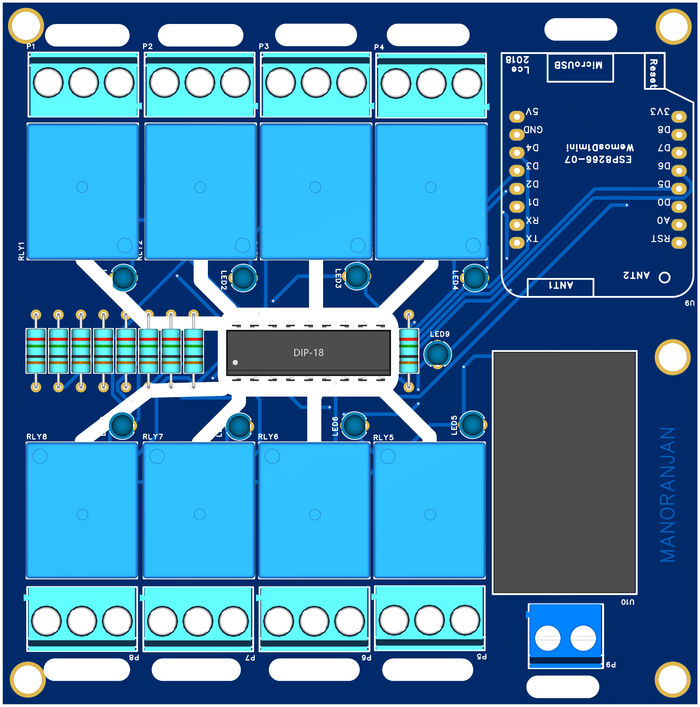
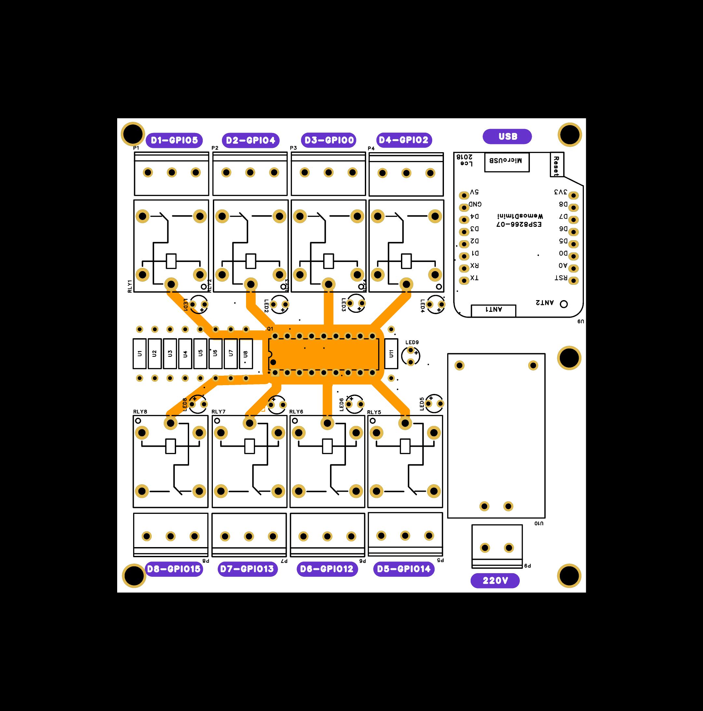

# 🏠 ESP8266 Wemos D1 Mini – 8-Channel Relay Home Automation Board

### 🖼️ 3D PCB View

### 🖼️  PCB View

### 🖼️ 2D PCB View

This is a compact and efficient **8-channel relay control board** powered by the **Wemos D1 Mini (ESP8266)**. Ideal for **WiFi-based home automation**, this board lets you control AC appliances like lights, fans, and plugs remotely using Tasmota, ESPHome, or custom firmware.

---

## 🧠 Key Features

✅ ESP8266-based (Wemos D1 Mini)  
✅ 8x Relay outputs (AC/DC load control)  
✅ Built-in ULN2803A relay driver  
✅ 5V power supply via HLK-PM01 AC-DC module  
✅ Indicator LEDs for each relay  
✅ Compact and modular design  
✅ Tasmota / ESPHome compatible

---

## 🖼️ Hardware Overview

- **Wemos D1 Mini** for WiFi control  
- **ULN2803A** handles relay switching  
- **SRD-05VDC-SL-C relays** (5V, 10A rated)  
- **HLK-PM01** provides isolated 5V from AC  
- **8 x Indicator LEDs** with current-limiting resistors  
- Screw terminals for AC load connection  
- Clean silkscreen and labeled GPIOs

---

## 🧰 Bill of Materials (BOM)

| Component | Quantity | Description | Buy Link |
|----------|----------|-------------|----------|
| Wemos D1 Mini | 1 | ESP8266 WiFi board | [Buy](https://www.lcsc.com/product-detail/WEMOS-D1-Mini.html) |
| ULN2803A | 1 | Relay driver IC | [Buy](https://www.lcsc.com/product-detail/ULN2803A.html) |
| SRD-05VDC-SL-C | 8 | 5V Relay (10A) | [Buy](https://www.lcsc.com/product-detail/SRD-05VDC-SL-C.html) |
| HLK-PM01 | 1 | 230V to 5V AC-DC Module | [Buy](https://www.lcsc.com/product-detail/HLK-PM01.html) |
| Resistors 150Ω | 9 | For relay LEDs | [Buy](https://www.lcsc.com/product-detail/150R.html) |
| LEDs (3mm Blue/Red) | 9 | Relay indicators | [Buy](https://www.lcsc.com/product-detail/LED-3mm.html) |
| Screw Terminals 5.08mm | 9 | Load connection | [Buy](https://www.lcsc.com/product-detail/WJ300V-5.0-3P.html) |
| DIP-18 Socket | 1 | For ULN2803A | [Buy](https://www.lcsc.com/) |
| PCB (Custom) | 1 | Designed in EasyEDA | — |

📥 Full BOM: [Download BOM](BOM/BOM.xlsx)

---

## 🔌 GPIO Mapping (Relay Control)

| Relay | ESP8266 GPIO | Wemos Pin |
|-------|--------------|------------|
| RLY1 | GPIO5 | D1 |
| RLY2 | GPIO4 | D2 |
| RLY3 | GPIO0 | D3 |
| RLY4 | GPIO2 | D4 |
| RLY5 | GPIO14 | D5 |
| RLY6 | GPIO12 | D6 |
| RLY7 | GPIO13 | D7 |
| RLY8 | GPIO15 | D8 |

---

## 📷 Demo and Views

### 📐 Schematic (PDF)
[📥 Download Schematic](Schematic/Schematic.pdf)

### 📸 Example Project Use

---

## 💡 Use Cases

- Control room lights, fans, and plugs over Wi-Fi  
- Create a fully local smart home (with ESPHome + Home Assistant)  
- Build DIY automation routines with MQTT or Blynk  
- Retrofit your existing switchboard with smart capabilities

---

## 📫 Contact

- 📧 Email: **electroiot.in@gmail.com**
- 📧 Email: **electroiot@hotmail.com**
- 🌐 Website: **https://electroiot.in**

---

## 🙏 Special Thanks

A big thank you to the following platforms for their amazing tools and support in designing this open-source hardware project:

  &nbsp;&nbsp;&nbsp;&nbsp;&nbsp;&nbsp;&nbsp;
  

- **[EasyEDA](https://easyeda.com/)** – for their powerful PCB design tools  
- **[OSHWLab](https://oshwlab.com/)** – for hosting open-source hardware projects

Their platforms made this project possible and easy to share with the maker community ❤️

## 📬 License

Open Source Hardware — OSHWA Certified

---

Happy Making! 💡